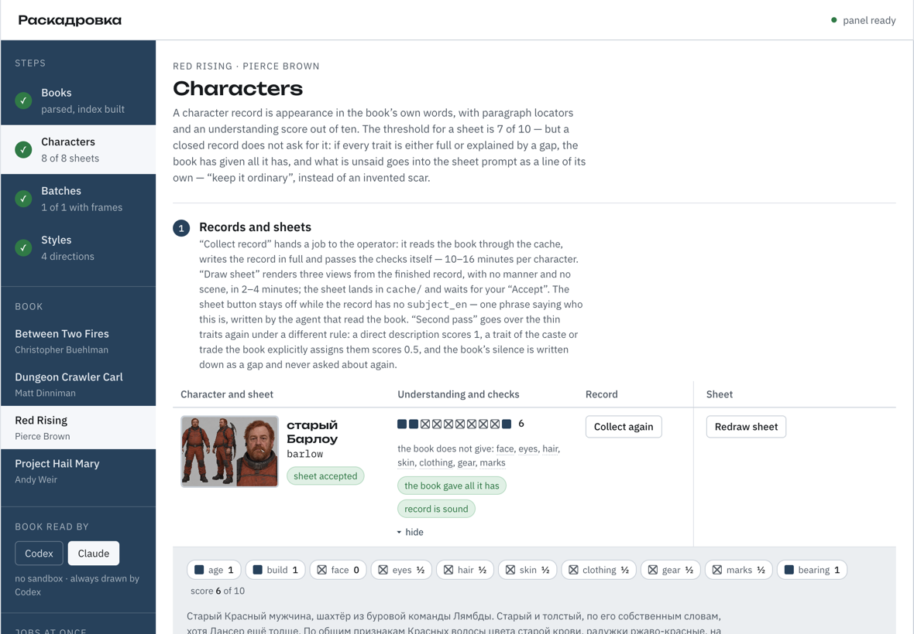
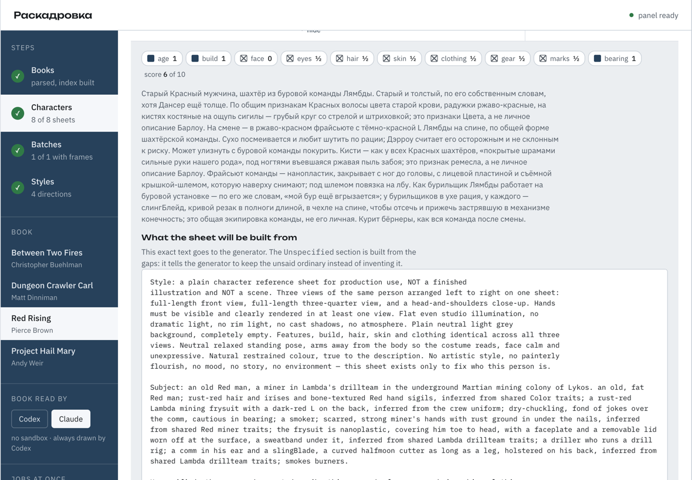

# Раскадровка — сцены из книг по стилевому референсу

*[English](README.md) · Русский*

Книга подаётся агенту, агент режет её на важные сцены, каждая сцена описывается карточкой, а
карточка вместе со стилевыми референсами становится промптом для генерации картинки. На выходе —
серия иллюстраций к книге в одной манере, с полной историей: какая сцена, какой промпт, какие
референсы, какой результат.

Проект вырос из [«Окрестностей»](https://github.com/DiorditsPV/okrestnosti) — серии плакатов
о районах Москвы. Оттуда взята вся машинерия: устройство партии, манифест с хешами, роли
референсов в промпте, галерея с проверками и правила для агента. Что уже перенесено и что ещё
предстоит — в [плане ребилда](docs/superpowers/plans/2026-09-07-rebuild.md); замысел и контракты
данных — в [спецификации](docs/superpowers/specs/2026-09-07-raskadrovka-design.md).

<table>
<tr>
<td width="50%"></td>
<td width="50%"></td>
</tr>
<tr>
<td><em>Одна книга, два направления: машинерия серии та же, манера разная.</em></td>
<td><em>Содержание кадра — из карточки сцены, манера — из направления.</em></td>
</tr>
</table>

## Как это работает

1. **Приём книги.** FB2, EPUB или TXT раскладывается на главы и абзацы. Сам файл остаётся в
   локальной игнорируемой папке; в репозиторий попадает только `book.json` — автор, издание,
   статус прав, хеш файла, оглавление и хеши абзацев.
2. **Раскладка на сцены.** Агент читает книгу и пишет карточки сцен. На длинных книгах, где
   читать всё дорого, дешёвый скрипт сначала отбирает кандидатов по эвристикам — описательность,
   смена места, свет и цвет, мало диалога, — и агент смотрит только их окрестности.
3. **Библия и листы персонажей.** Один раз на книгу собираются внешность героев и вид мест с
   локаторами в тексте, и на каждого героя генерируется лист персонажа. Лист подмешивается в
   каждый промпт, чтобы герой на десяти картинках был одним человеком: описание словами этого
   не держит.
4. **Направление стиля.** Манера берётся из `styles/<направление>/` — папки, где манера описана
   словами и подкреплена свободными референсами. Партия снимает с направления копию, поэтому
   провенанс каждой серии самодостаточен.
5. **Промпт.** Собирается из карточки, библии, листов и записей о референсах детерминированно и
   коммитится целиком. Референсы задают палитру и рисовку, лист — лицо героя, карточка —
   содержание кадра.
6. **Генерация и галерея.** Встроенный инструмент генерации, один вызов на сцену, правки
   через edit-target. Результат регистрируется в манифесте, проверка сверяет права и хеши,
   галерея пересобирается.


*Лист рисуется один раз на героя, по записи, без манеры и без сцены — три проекции и видимые
руки. Он подмешивается в каждый промпт кадра, чтобы герой на десяти картинках был одним
человеком: описание словами этого не держит.*

## Права

**Репозиторий публичный, и это учтено в его устройстве.** Книги в нём четыре, все под
охраной: в git идут манифест без текста, хеши абзацев, описания внешности словами книги
с указателями и сгенерированные здесь листы персонажей. Пределы цитирования заданы
константами и проверяются `scripts/check_rights.py`, а не соблюдаются на память.

Текст книги в репозитории не хранится. В карточке сцены допускается отрывок не длиннее двух
абзацев — целыми абзацами, с указанием автора, переводчика и издания; для книг в общественном
достоянии ограничение снимается. Совпадение отрывка с абзацами локатора проверяется по хешам
абзацев, поэтому проверка работает на любой копии, а не только у автора. Стилевые референсы
коммитятся только со свободной лицензией и обоснованием свободы в России и в США, остальные
живут локально и упоминаются хешем. Подробности — в [RIGHTS.md](RIGHTS.md).

## Структура

```text
index.html                      галерея
output/<книга>--<партия>--<сцена>.png
scripts/
  ingest_book.py                FB2/EPUB/TXT -> book.json без текста; метаданные из файла
  index_book.py                 механический индекс по всей книге: лица, места, сцены
  show_paragraphs.py            печать нужных абзацев из локального кеша
  build_prompt.py               промпт сцены из карточки, стиля, шаблона и листов
  generate_sheet.py             лист персонажа: промпт из записи, картинка — Codex
  generate_scene.py             кадр сцены: промпт, картинка, запись в манифест
  register_result.py            хеши, снимок input/, refs.json партии
  check_rights.py               права: книга, цитирование, лицензии референсов
  build_gallery.py              сборка и сверка index.html
  build_styles_page.py          сборка styles/index.html
styles/
  directions/<направление>.json манера словами, палитра и записи об эталонах
  refs/<направление>/           эталоны манеры
  prompts-directions.md         промпты, которыми эталоны сгенерированы
  index.html                    страница выбора направления
compositions/
  templates/<шаблон>.json       расстановка тел: кто где стоит, какая камера
  refs/<шаблон>.png             серый блокинг
books/<книга>/
  book.json                     манифест книги без текста
  bible.json                    персонажи и места
  characters/<ключ>.png         листы персонажей
  characters/history/           прежние листы: чем заменили и что отклонили
  source/                       файл книги — локально, в git не попадает
  <партия>/
    README.md                   что в партии и ссылки на результаты
    scenes/<сцена>.json         карточки сцен
    prompt/<сцена>.txt          точные промпты
    input/                      референсы партии; input/<сцена>/ — edit-target кадра
    metadata/request.json       манифест партии: сцены, хеши, роли входов
    metadata/refs.json          источники и лицензии референсов
```

Подробное устройство папки книги — в [books/README.md](books/README.md), направления стиля —
в [styles/README.md](styles/README.md), шаблоны композиции — в
[compositions/README.md](compositions/README.md).

## Панель управления

Тот же путь без терминала:

```bash
python3 panel/server.py --port 8770 --open
```



*Слева — этапы, по которым идёт книга, сами книги, оператор и сколько заданий идут рядом.
В середине — герой: принятый лист, десять клеток полоской, чего книга не даёт, и кнопки,
которыми работа движется дальше. Справа — очередь заданий с часами и логами.*

Локальное окно в репозиторий: весь путь от файла книги до кадра, без терминала. Книги и их
прогресс, записи героев с аудитом понимания и результатом проверки, партии, направления стиля
с эталонами, очередь заданий с логами. Ничего своего панель не хранит — состояние это те же
файлы, и шаг, сделанный руками в терминале, она увидит.

Шаги, где нужно суждение, панель отдаёт **оператору** — Codex или Claude, выбор в боковине —
и сама проверяет результат. Разница между ними одна и названа вслух: `codex exec` пишет
только в рабочий каталог, `claude -p --permission-mode bypassPermissions` не ограничен ничем.
Рисование выбора не имеет: `image_gen` есть только у Codex.

Отбор остаётся за человеком: какие герои нужны, какой лист принять, какие сцены рисовать.

Что панель делает сама:

- **читает книгу о себе** — название, автора, переводчика, год и издание берёт из fb2 или
  epub, слаг складывает из названия; человеку остаются только права;
- **собирает запись героя** словами книги, с указателями на абзацы и аудитом понимания
  из десяти клеток;
- **добирает внешность** вторым заходом по просевшим клеткам: прямое описание даёт клетке
  единицу, признак сословия или ремесла — половину, а молчание книги записывается пробелом
  и больше не спрашивается. Пробел уходит в промпт листа отдельным разделом — «оставь
  обычным» вместо выдуманного;
- **рисует лист и кадр** и кладёт их на приёмку: судья содержания — человек, не проверка;
- **хранит прежние листы**: приёмка и отказ ничего не стирают, к любому варианту можно
  вернуться;
- **ведёт несколько заданий рядом** — сколько разрешает настройка, и только те, что не спорят
  за один файл: записи героев одной книги идут по очереди, листы и разные книги — одновременно.



*«Что в записи», раскрыто. Клетки названы и с баллами; описание словами книги; ниже — ровно
тот текст, что уйдёт генератору, вместе с разделом `Unspecified`, собранным из пробелов:
он велит оставить несказанное обычным, вместо выдуманного.*

Интерфейс двуязычный — русский и английский, переключатель в боковине.
На снимках он английский. Переводится только
то, что написала панель: имена героев, описания и тексты агента остаются как есть, потому
что это данные книги.

Устройство и экраны — [спецификация панели](docs/superpowers/specs/2026-09-09-panel-design.md).

## Что нужно, чтобы запустить у себя

- **Python 3.10+**. Скрипты и панель — только стандартная библиотека, ставить нечего.
- **Свой файл книги** — fb2, epub или txt. В репозитории книг нет и не будет: сюда попадают
  манифест, хеши абзацев и записи героев, а сам текст лежит в игнорируемой
  `books/<книга>/source/`. Раскладку по этому репозиторию воспроизведёт тот, у кого есть
  свой экземпляр книги.
- **Оператор** для шагов с суждением — хотя бы один из двух, настроенный и вошедший в
  аккаунт: [Codex CLI](https://github.com/openai/codex) (`codex exec`) или
  [Claude Code](https://github.com/anthropics/claude-code) (`claude -p`). Панель зовёт их
  сама; команда меняется в `cache/panel/settings.json`.
- **Картинки рисует Codex**: инструмент генерации изображений есть только у него. Без Codex
  работает всё, кроме листов персонажей и кадров.
- `pytest` — только для тестов, в работе не нужен. Один тест разбирает скрипт панели через
  `node --check` и пропускается, если node не установлен.

Деньги и лимиты расходует оператор, а не панель: запись героя — это 7–16 минут работы
Codex или Claude, лист персонажа — 2–4 минуты. Сколько заданий идут рядом, видно и меняется
в боковине панели.

## Запуск

```bash
python3 scripts/register_result.py books/<книга>/<партия>   # хеши, input/, refs.json
python3 scripts/check_rights.py                            # права
python3 scripts/build_gallery.py                           # пересобрать index.html
python3 scripts/build_styles_page.py                       # пересобрать styles/index.html
pytest tests/                                              # все проверки проекта
```

Порядок не случаен: регистрация записывает, из чего получены кадры, проверка прав читает
записанное, сборка галереи сверяет хеши и падает, если картинка нарисована по карточке,
которой больше нет.

Скрипты используют только стандартную библиотеку Python 3.10+. Тесты — `pytest tests/`, он
ставится отдельно и в проекте не требуется. Один тест разбирает скрипт панели через
`node --check` и пропускается, если node не установлен: страница панели — единственный файл
без сборки, и синтаксическую ошибку в нём больше ловить нечем.

## Родство с «Окрестностями»

Там вход — фотография места, здесь — текст сцены; роль стилевого референса та же. Московские
плакаты остались в родительском проекте, здесь коллекции — книги.
